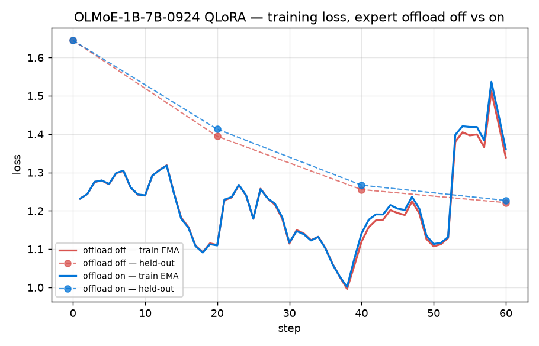
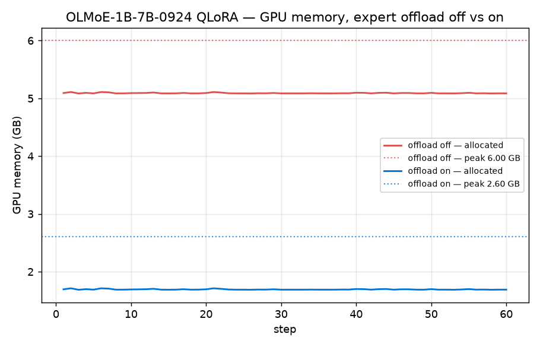
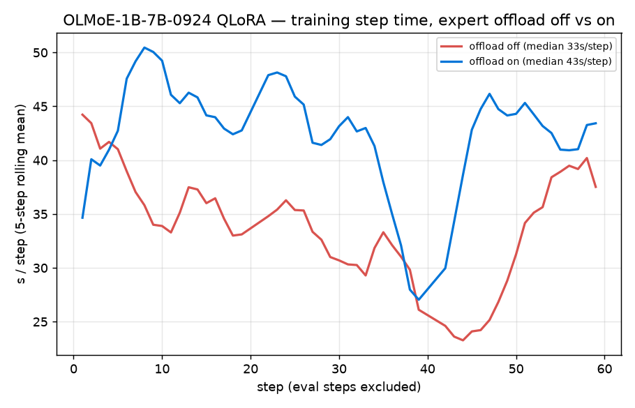

# Expert-offload A/B telemetry (OLMoE-1B-7B QLoRA, single RTX A2000 12 GB)

Matched A/B measuring exactly one variable — `OFFLOAD_EXPERTS` off vs on — for the
expert-granularity CPU-offload feature (proposed upstream in
[axolotl#3787](https://github.com/axolotl-ai-cloud/axolotl/issues/3787)).

Both arms share the same seed (`torch.manual_seed(0)`) and therefore the same data order,
so the loss curves are directly comparable step-for-step. Trainer =
[`experts4bit_qlora/train.py`](../experts4bit_qlora/train.py) with opt-in telemetry
(`WANDB=1`, `METRICS_JSONL=<path>`; both default-off) from branch
[`telemetry-wandb-jsonl`](https://github.com/pjordanandrsn/experts4bit-qlora/tree/telemetry-wandb-jsonl).

## Config (identical for both arms)

```
MODEL=allenai/OLMoE-1B-7B-0924  STEPS=60  EVAL_EVERY=20  SEQ=256  N_TRAIN=3000
GRAD_ACCUM=4  LR=1e-4  R=8  ALPHA=16  seed=0  (Alpaca, response-only loss,
gradient checkpointing use_reentrant=False)
```

Hardware: single RTX A2000 12 GB (sm_86) on a shared host; container CPU-capped at 2 cores.

## Results

| config | loaded GPU | peak GPU | median s/step | held-out eval (before → after) |
|---|--:|--:|--:|--:|
| experts resident on GPU | 4.70 GB | 6.00 GB | 33.5 | 1.6448 → 1.2213 (−0.4235) |
| experts offloaded | **1.08 GB** | **2.60 GB** | 43.4 | 1.6448 → 1.2270 (−0.4178) |

- **Peak VRAM −57 %** (6.00 → 2.60 GB), load-time footprint **−77 %**.
- **Convergence preserved**: identical BEFORE (same seed), final-loss gap within fp noise of
  the dequant/reload path.
- **Throughput caveat**: the +30 % median s/step above is an *upper bound* — the host was under
  heavy external CPU load (~55 on 12 cores) during both arms, which inflates the offload arm's
  H2D cost. Uncontended, the same card measures ~+11 % (see the top-level README benchmarks).





## Artifacts

| path | what |
|---|---|
| `runs/olmoe_off.jsonl`, `runs/olmoe_on.jsonl` | per-step metrics (loss/EMA, GPU alloc, s/step, evals, config + summary records) |
| `charts/*.png` | rendered from the JSONL by `make_charts.py` |
| `wandb/wandb/offline-run-*-nut4l67k` | wandb offline run, offload **off** (`wandb sync` to upload) |
| `wandb/wandb/offline-run-*-jym7tnum` | wandb offline run, offload **on** |
| `run_ab_resilient.sh` | the A/B supervisor (idempotent phase sentinels, per-attempt JSONL reset, GPU-free gate, retry) |

Regenerate charts + the markdown table:

```
python ab-telemetry/make_charts.py ab-telemetry/runs/olmoe_off.jsonl \
    ab-telemetry/runs/olmoe_on.jsonl ab-telemetry/charts
```

Step-time medians and the throughput plot exclude eval steps *and* the step after each eval
(the mid-loop eval + best-checkpoint save lands on the next step's wall-clock).
