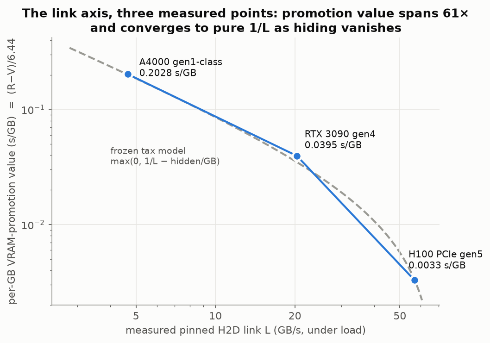
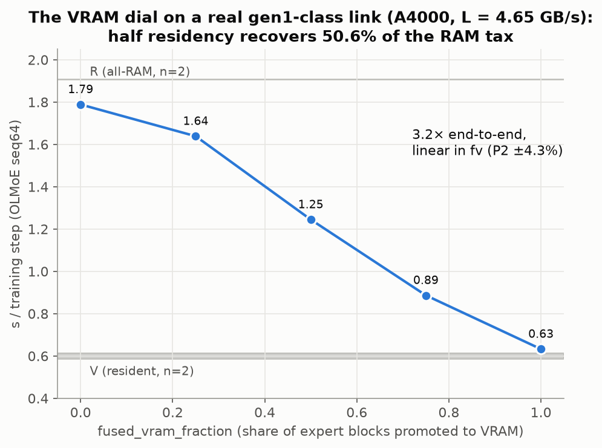
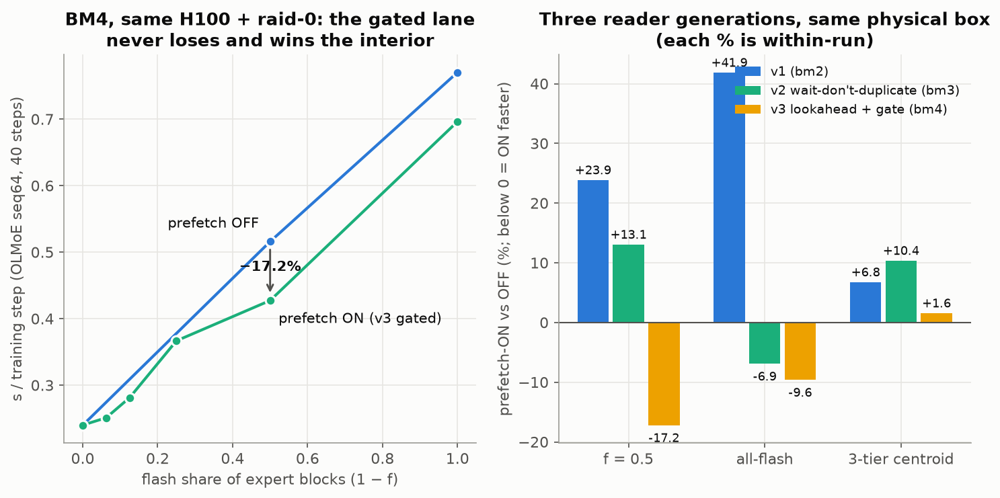
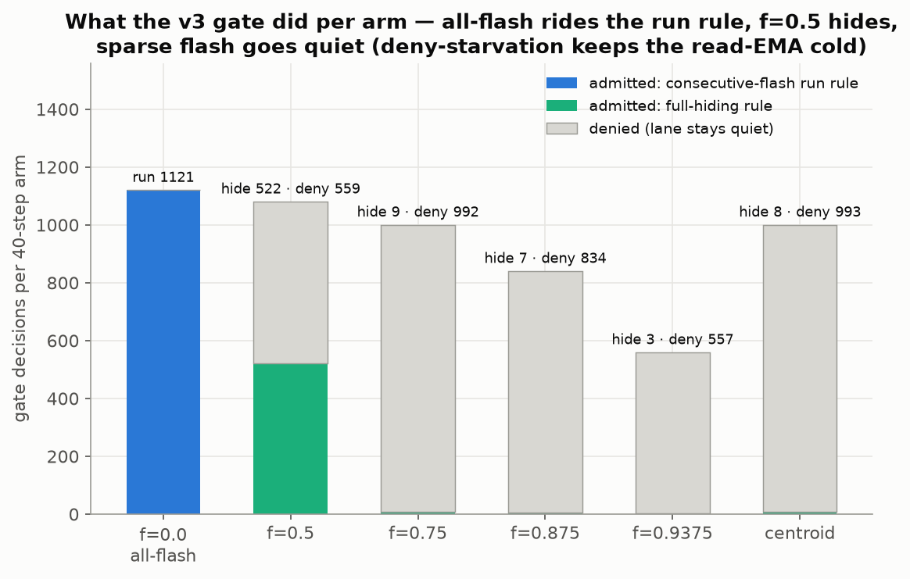
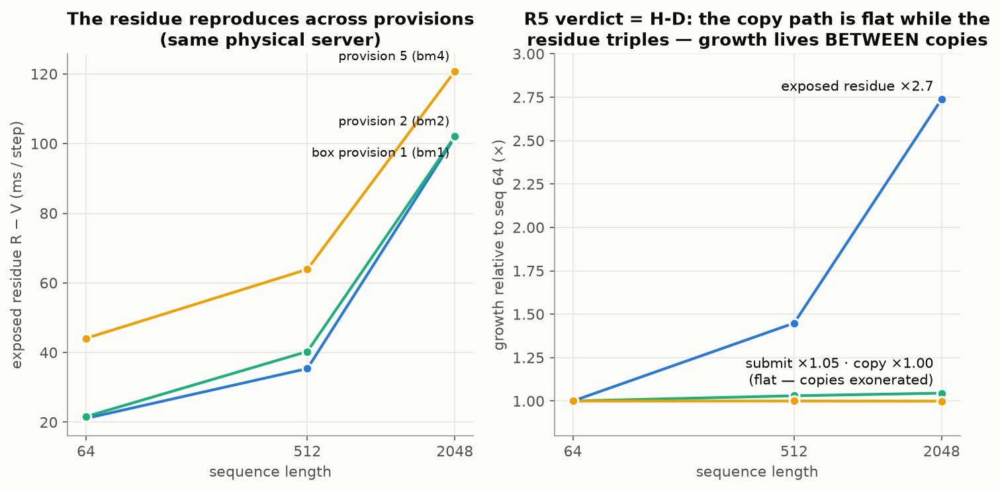

# The memory hierarchy is a dial, not a wall — the expert-offload thesis, fully measured

*Consolidation of the complete measurement program (2026-05 → 2026-07-13). Every
number below traces to a committed, OpenTimestamps-anchored reduction in this
directory; verdict criteria were pre-registered before their data, and the
negatives are reported at the same volume as the positives. This document
supersedes the 2026-07-12 synthesis where they overlap (the knee is now located;
the early "7.16 GB peak" footprint note was an artifact of the since-fixed
bitsandbytes retention leak).*

## The thesis

A 4-bit MoE's frozen expert weights do not have to live in VRAM. Homed in pinned
RAM and on NVMe flash behind a **static placement map**, and staged one block at
a time behind an async H2D copy, they train **bit-identically** to the resident
model — and the *cost* of any placement is a measured, linear, predictable
function of three per-host constants. Placement stops being an OOM cliff and
becomes an economics problem: fill the fastest tier you can afford, and the
model tells you — to ≤10% — what every mix will cost before you run it.

The program's job was to earn each clause of that paragraph with hardware
measurements. It is done. What follows is the evidence, the design rules that
fall out, the capability it unlocks, and the honest boundaries.

## 1. The three constants, measured per host

Everything reduces to V (resident step time), R (all-RAM step time), F
(all-flash step time) — equivalently, the link bandwidth L and storage
bandwidth S that produce them. Measured on three hosts spanning 12× in link
speed (all OLMoE-1B-7B QLoRA, seq64, 40 steps, seed 42, n=2 floors):

| host | L (pinned H2D, under load) | V s/step | R s/step | RAM tax (R−V) | per-GB VRAM-promotion value |
|---|---:|---:|---:|---:|---:|
| H100 PCIe gen5 (bare metal, raid-0) | 56.74 GB/s | 0.2075 | 0.2286 | 21 ms (+10%) | 0.0033 s/GB |
| RTX 3090 (gen4 x16) | 20.36 GB/s | 0.3735 | 0.6278 | 254 ms (+68%) | 0.0395 s/GB |
| RTX A4000 (gen1-class host) | 4.65 GB/s | 0.600 | 1.907 | 1.306 s (+218%) | 0.2028 s/GB |

Storage, on the bare-metal host: single NVMe 1.52 GB/s (fio QD1, O_DIRECT),
RAID-0 stripe 3.61 GB/s, through-path effective ≈ 12.2 GB/s (per-slot reads
overlap).

## 2. The design rules the measurements bought

**Rule 1 — the waterfall predicts every mix (≤10%).** Corner-calibrate
`t = V + f_r(R−V) + f_f(F−V)` from three runs and it prices any simultaneous
vram/ram/flash placement: centroid +9.4%, vram+ram(½,½) −6.4% — landing *at*
the resident floor on gen5 — vram+flash(½,0,½) −0.1% (24-arm bare-metal chain).
Interior linearity held on every host tested (±10% H100, ±3.5% 3090, ±4.3%
A4000).

**Rule 2 — fill RAM before flash, and VRAM before RAM only when the link is
slow.** On gen5, moving a GB from flash→RAM buys ~0.64 s/step and RAM→VRAM only
~0.018 (36×): RAM is the workhorse tier. As the link slows, VRAM promotion
value rises 61× across the measured range and converges to pure 1/L (log-log
slope 2.42 → 1.11) — exactly what the frozen tax model
`max(0, transfer/L − hidden)` predicts once compute can no longer hide
transfers. On consumer links the dial is worth real wall-clock: **1.71×**
end-to-end on the 3090, **3.2×** on the gen1-class host, linear in
`fused_vram_fraction`, bit-exact at every point.

**Rule 3 — the flash share has a knee, and it is located.** Throughput holds
the RAM-tier floor until the flash share exceeds ≈ `1 − S_eff/L`: ~3–6% of
blocks on the gen5 link with a single drive, **~22% with a RAID-0 stripe**
(effective knee 0.78; striping cut the all-flash step −36% on identical work).
The knee is a *hardware ratio*, so it moves the right way for consumers: slower
links afford proportionally more flash.

**Rule 4 — long context is where the slow tiers are cheapest.** The whole-layer
staging penalty shrinks +273% → +109% as effective tokens grow 64 → 2048
(compute hides staging), and the routed read-fraction window (Phase-0 access
measurement: E=128 crosses 50% expert coverage only at ~57 tokens, plateaus at
0.80) widens with expert count — wider MoEs benefit more.

## 3. The demonstration: 30B QLoRA on a 24 GB card

The capability the rules add up to: **Qwen3-30B-A3B QLoRA-trains on a single
RTX 3090** — the exact config that OOM'd at 22.4 GiB — after the
dequant-retention fix, with the entire 14.5 GB expert pool placeable anywhere
on the dial: fv_max = 1.0 fits with ~8 GB headroom, and `fused_vram_fraction`
dials a **1.92× speedup** (2.77 → 1.44 s/step) whose slope equals the two-touch
transfer time (measured b = 1.291 vs 2P/L = 1.257, ratio 1.03) — the model
predicting its own knob, on the hardware class that needs it.

The blocker it removed is upstream-relevant on its own: bitsandbytes'
parametrize-cache gate leaks under `use_reentrant=False` checkpointing
(early-stop skips the post-hook), retaining **every dequantized parameter** —
~53 GB on Qwen3-30B, ~13 GB on OLMoE, enough that even *resident* OLMoE OOMs a
16 GB card. Root-caused to two lines, mutation-tested, validated three
independent times (30B-on-24GB, the leak arithmetic, resident-on-16GB), and
filed as [bitsandbytes #1999](https://github.com/bitsandbytes-foundation/bitsandbytes/pull/1999).

## 4. Training vs decode: the honest staging boundary

**Whole-layer staging is the training path** — bit-identical forward
(5.30==5.30 at 30B scale), convergence preserved where resident OOMs, FileStore
byte-identical to RAMStore against a measured noise floor.

**Routed-subset staging (stream only the experts a forward routes to) is
decode/inference-only.** Its training divergence was chased to the root through
a six-probe pre-registered mechanism hunt: the divergence scales with un-routed
fill mass, content-masking halves it, a full-count control is *exactly* zero,
and a √N-resolution activation diff pinned the seed — the zeroed rows perturb
the fused dequant of the forward by ~5e-5, coherent and depth-accumulating,
below both eval print-precision and the gradient noise floor, compounding to a
104× loss gap over 150 steps. Subset-intrinsic; recovers only at read-fraction
1.0, which defeats the purpose. The claim that survives is stronger than a
hopeful maybe: *routed staging is an inference-bandwidth technology; training
requires whole-layer, for a now-understood numerical reason.*

## 5. The prefetch lane: three generations to a defensible default

| | f=0.5 vs OFF | all-flash vs OFF | verdict |
|---|---:|---:|---|
| v1 (double-buffer) | +23.9% | +41.9% | duplicate I/O on take() miss — refuted as implemented |
| v2 (wait-don't-duplicate) | +13.1% | **−6.9%** | catastrophe fixed; interior still net overhead |
| v3 (next-flash lookahead + adaptive gate) | **−17.2%** | **−9.6%** | K1/K2/K4 PASS; K3 (3-tier centroid) +1.6% |

All three measured on the *same physical server*. The v3 gate admits a
read-ahead only when the placement-derived window covers the observed read time
or the target continues a flash run; its decision counters show the mechanism
working — and its one humility, **deny-starvation** (cold first reads park the
read-EMA high at sparse flash, so the lane goes quiet rather than wrong), errs
in the safe direction. Product posture: `prefetch: false` remains the default
in the below-knee regime the thesis targets (the gate itself denies there);
`prefetch: true` is now safe everywhere and profitable when flash-heavy.

**Bounded residual:** a sequence-length-dependent exposed cost (R−V grows
21→102 ms, seq 64→2048) was decomposed with a per-stage probe: host submit
flat, device copies flat at full link speed, zero allocator retries — the
copies are exonerated; the growth sits *between* copies, at the trainer's own
sync points (≈21 ms/step of host `cudaStreamSynchronize`; each drain leaves the
next stages nothing to hide behind). It is already priced into the measured
V/R corners, so the waterfall absorbs it; it caps what any prefetching could
ever recover at long sequence.

## 6. Method as an asset

Every load-bearing claim above was **pre-registered with OTS-stamped verdict
criteria before its data existed**; floors were measured (n=2 spreads
0.0002–0.0018 on metal), engagement was asserted per arm (a crashed arm cannot
impersonate a result), degenerate ends were gated before every sweep (f=1.0 ==
RAMStore ≤0.5% — a gate that caught a +15.4% self-serialization bug that
correctness checks could not see), and the same physical server was re-provisioned
five times for same-silicon comparisons. The negatives — routed training, the
v1/v2 prefetch failures, a P1 ends-parity miss on a noisy community host — are
committed with the same prominence as the wins. Program cost: ≈$80 across ~20
rentals, every teardown 404-verified.

## 7. Open / commercial boundary

**Open (the ability to verify):** the axolotl `feature/expert-store`
integration — whole-layer offload, RAMStore/FileStore, correctness gates, the
public benchmark kit and every result in this directory — reproducible by
anyone with the RUNBOOK and a weekend.

**Commercial (knowing what to place where):** FusedStore's three-tier placement
and the intelligence this program measured into existence — the per-host
constants, the knee location, the waterfall calibration, fv dialing against a
VRAM budget, and the gated prefetch lane. The measurements above are exactly
the pricing function a placement product sells: *given your card, your link,
your drives, and your model, here is the cheapest placement that meets your
step-time — guaranteed bit-exact.*

## Provenance

Preregistrations, results, evidence hashes, and OTS stamps live alongside this
file; the arc's session docs are `RESULTS-baremetal.md`,
`baremetal2-design-case/`, `baremetal4-gated-residue/`, `vram-tier-3090/`,
`vram-tier-30b/`, `gen1-hunt/`, and `EXPERT-OFFLOAD-SYNTHESIS.md` (the routed
causal chain in full). Charts: `thesis-charts/`.
